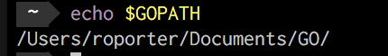

# go-UCSPMMetering

## Setting up your GO environment
Depending on your particular environment, there are a number of ways to setup and install GO.  This repo was developed on a MAC and was installed using Brew.  For instructions on installing HomeBrew, please check [here](https://brew.sh/); and then entering;
```fish
> brew install go
```

If you do not want to use HomeBrew or you are running on a different platform, you can install the GO language using a binary from here;
https://golang.org/dl/

Once this has completed, open a cmd or terminal window and check GO has been installed and configured correctly;

Enter <b>echo $GOPATH</b>, hopefully you will be presented with a path and should be ready to go.



## Testing your GO environment
Once you have completed the above, its time to create a very simple test script to ensure everything is ready.

Go to a path where you are happy to store the source code for your application, this could be anywhere, including your desktop, documents, root folder, etc.

Create a folder and enter the directory.  Create a new file called "main.go" and enter the following code into it;

```go
package main

import "fmt"

func main() {
    fmt.Println("GO is working!")
}
```

At the command line, change directory using cd to the directory where your main.go file is and execute the following;
```fish
> go run main.go
```

You should see as output, something similar to;

"GO is working!"

If you reached this point, everything is working and you are ready to run the included code!

## Getting the code
There are a couple of ways you can get the code, depending on how comfortable you are with the command line and development envrionments;

You could download the zip file, [here](https://github.com/robjporter/go-UCSPMMetering/archive/master.zip).

You could use the command line git command to clone the repository to your local machine;
1) At the command line, change directory using cd to the directory where the repository will be stored.
2) Enter, git clone https://github.com/robjporter/go-UCSPMMetering.git
3) You will see output similar to the following while it is copied.
```fish
Cloning into `go-UCSPMMetering`...
remote: Counting objects: 10, done.
remote: Compressing objects 100% (8/8), done.
remove: Total 10 (delta 1), reused 10 (delta 1)
unpacking objects: 100% (10/10), done.
```
4) Change into the new directory, cd go-UCSPMMetering.
5) Move onto setting up the application.

## Setting up application